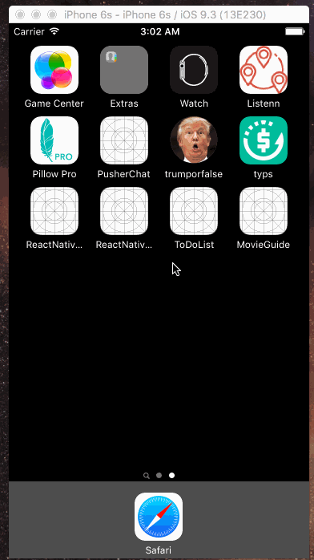

# MobileSpace Tutorial Series

### Introduction to iOS Apps

## Project 2: MovieGuide

**Objective:** Learning how to make a hit a web API and process the response JSON into model objects.

## Milestones:

1.  Building the Movies Table view with custom UITableViewCell and detail view

2.  Making the API call and getting a response object; storing it in relevant data models

3.  Clean up and post-processing

## API:

Source: [The Movie Database](https://www.themoviedb.org/)

API Docs: [The Movie Database API documentation](docs.themoviedb.apiary.io)

Endpoint used: http://api.themoviedb.org/3/movie/now_playing

## App Demo:

## Pods for MovieGuide
  pod 'Alamofire', '~> 3.5.0'
  pod 'AlamofireImage', '~> 2.5'

